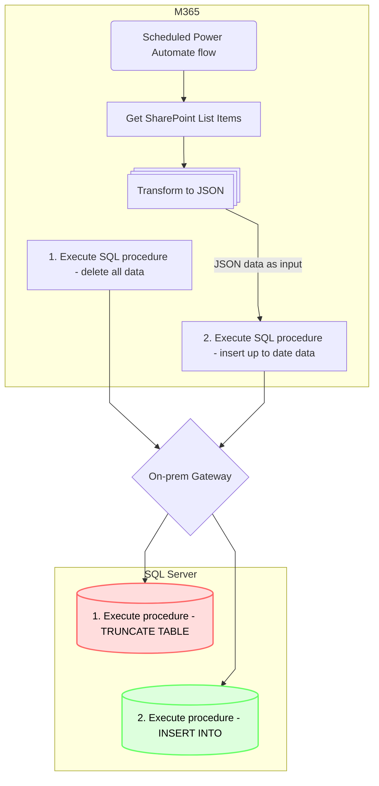

```mermaid
---
config:
  flowchart:
    curve: linear
---
flowchart TD
    subgraph M365[M365]
        Trigger(Scheduled Power Automate flow )
        FetchSPdata[Get SharePoint List Items]
        TransformJSON@{ shape: processes, label: "Transform to JSON"}
        TransformJSON ~~~ DeleteData["1. Execute SQL procedure - delete all data"]
        TransformJSON --> |JSON data as input|InsertData["2. Execute SQL procedure - insert up to date data"]
        DeleteData ~~~ InsertData
    end

    Trigger --> FetchSPdata --> TransformJSON
    DeleteData --> Gateway{On-prem Gateway}
    InsertData --> Gateway

    subgraph SQL[SQL Server]
        DeleteSQLdata@{ shape: cyl, label: "1. Execute procedure - TRUNCATE TABLE"}
        InsertSQLdata@{ shape: cyl, label: "2. Execute procedure - INSERT INTO"}
        DeleteSQLdata ~~~ InsertSQLdata
    end

    Gateway --> DeleteSQLdata
    Gateway --> InsertSQLdata

    style DeleteSQLdata fill:#fdd,stroke:#f66,stroke-width:2px,color:#000
    style InsertSQLdata fill:#dfd,stroke:#6f6,stroke-width:2px,color:#000
```
