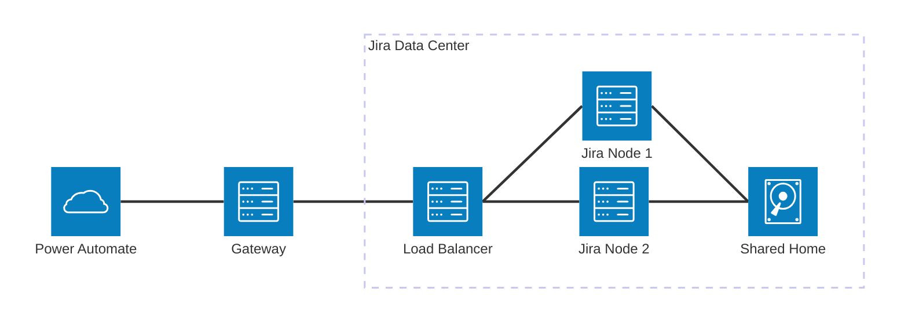

# Infrastructure

```mermaid
architecture-beta
    service powerautomate(cloud)[Power Automate]
    service gateway(server)[Gateway]

    group jdc[Jira Data Center]
    service lb(server)[Load Balancer] in jdc
    service jiranode1(server)[Jira Node 1] in jdc
    service jiranode2(server)[Jira Node 2] in jdc
    service sharedhome(disk)[Shared Home] in jdc

    powerautomate:R -- L:gateway
    gateway:R -- L:lb
    
    lb:R -- L:jiranode1
    lb:R -- L:jiranode2
    
    jiranode1:R -- L:sharedhome
    jiranode2:R -- L:sharedhome

```
