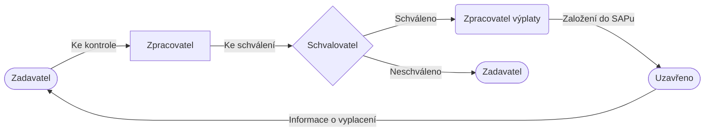

```mermaid
flowchart LR
    A([Zadavatel]) -->|Ke kontrole| Zpracovatel
    Zpracovatel -->|Ke schválení| C{Schvalovatel}
    C -->|Schváleno| D(Zpracovatel výplaty)
    C -->|Neschváleno| B([Zadavatel])
    D -->|Založení do SAPu| E([Uzavřeno])
    E -->|Informace o vyplacení| A

```
